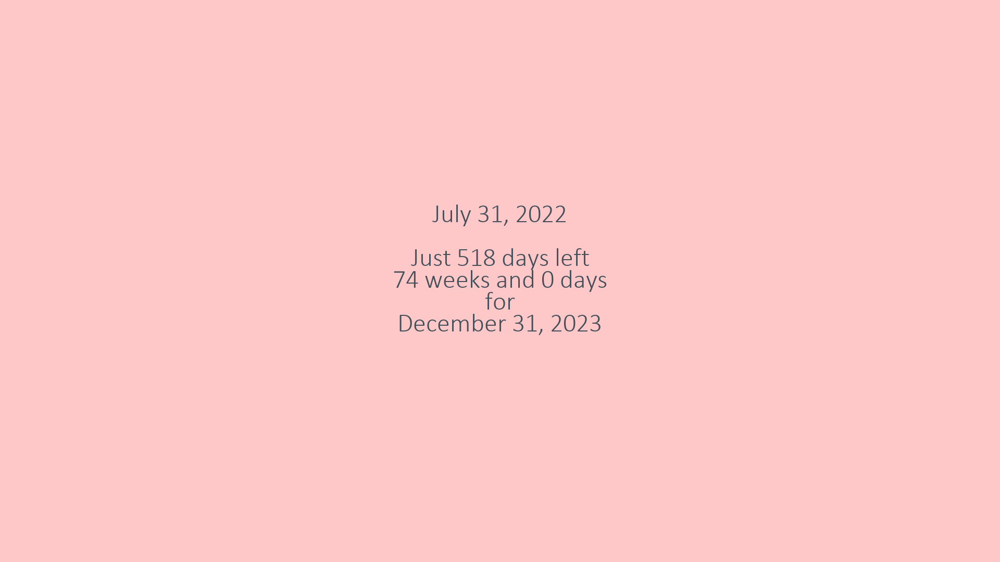
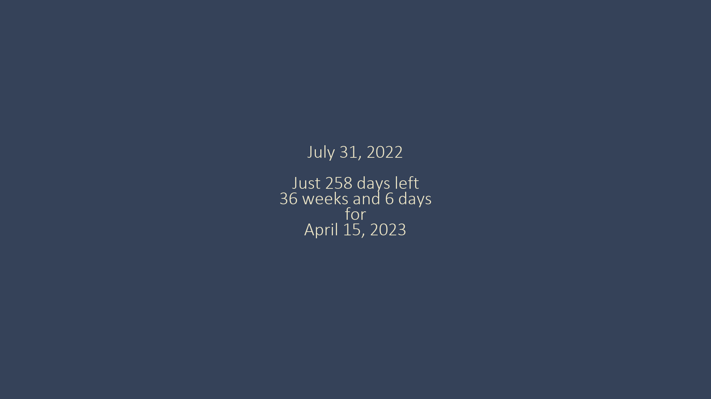

# Countdown-Wallpaper

A Python program that shows you a daily countdown to any date you choose by changing your desktop wallpaper. Currently works only on Windows.

The program creates a task using Task Scheduler to run the script everyday at midnight. As the script doesn't have to be running in the background all the time like other wallpaper engines, it is performance efficient. It also works offline.

After the final day has passed, it will change back to the original wallpaper.

Also supports dark and light themes!

I made this script because I couldn't find anything similar to this program so I decided to put my python skills to test and just build my own.
## Installation

Only [Pillow](https://github.com/python-pillow/Pillow) and [PyWin32](https://github.com/mhammond/pywin32) needs to be installed to run the script. 
1. Run the following command in command line to install the library.
```bash
pip install -r requirements.txt
```
2. Then run *Countdown_Wallpaper.py* and type in your preferred settings.

>**Note** 
> If you delete generated_assets folder, it will ask you to enter the settings again.

## Examples of Randomly Generated Wallpapers




## Feedback
All kinds of constructive feedback are welcome! Please create a pull request if you have any suggestions.

## License
This project is licensed under the terms of the [GNU General Public License v3.0](https://github.com/mukundhk/Countdown-Wallpaper/blob/master/LICENSE.md).
